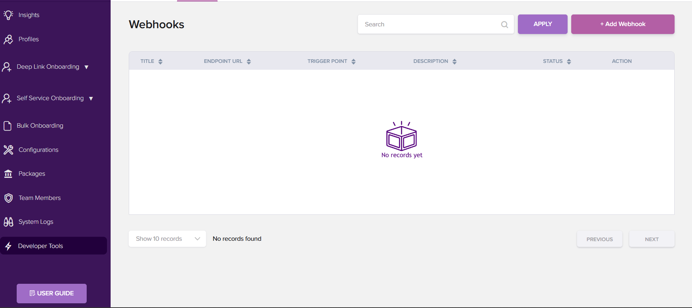

# API Integration Flow

To integrate with Idenfo Direct APIs, please follow the steps outlined below:

1. **Sign Up on Idenfo Direct** 

    Begin by creating an account on the Idenfo Direct platform.
    Please make sure you have the right Environment URL variable:
    
    For UAE, it is https://uaedirect.idenfo.com/

    For Pakistan, it is https://pkdirect.idenfo.com/
    
    For UK, it is https://ukdirect.idenfo.com/

    You can subscribe to the package suiting your required number of profiles, OR reach out to us for further inquiries and manual subscription.
    If you are not sure about the compatibility, you can contact us to acquire our system's test mode, where we will create Test credentials for you in our sandbox.
    Once testing is completed, production access can be provided.

    [See tutorial](https://www.loom.com/share/f3fd0b8e21654633b1842c332cab2562)

2. **Generate Access Keys**

    After signing up, generate your API and secret keys from the platform. These keys are essential for authenticating API requests.

    [See tutorial](https://www.loom.com/share/14905d596956443f8c187e432c59b46d)
    

3. **Authenticate via Login API**

    Use the generated API and secret keys in the login API to obtain an authentication token.

    [See tutorial](https://www.loom.com/share/6696e5040f2e411a86697399f30ef0e9)

4. **Include Auth Token and Access Keys in API Headers**

    For all subsequent API requests, include both the authentication token and access keys in the request headers to ensure successful communication.

5. **Customer Creation**

    Use the relevant API endpoint(s) to create a customer as per your requirements.

    [See tutorial](https://www.loom.com/share/40a9f9f4e99846b5bf7e8f060bca9b48)

6. **Data Retrieval Options**

        a. Use the **Fetch/Polling API** to retrieve customer or other data.

        b. Alternatively, you can set up a **Webhook** to receive data updates automatically. The process for configuring webhooks is documented below in detail:

    [See tutorial](https://www.loom.com/share/9b9c442de5a84e16a5ffb56da3d0061e)

--- 

1. **What are Webhooks?**

    The webhooks are callback links that you can setup on Idenfo to talk to your application. So you do not have to call the Fetch API repeatedly.

2. **Process Flow:**

    When create customer API is called, after the process is completed, the KYC result is transmitted to the provided endpoint automatically.
    1. Submit details to Idenfo via Submit API
    2. Idenfo calls your API and sends the data to your application whenever it is available.

3. **Configuration Process:**

    To add your endpoint as a webhook, please go to:

    https://(uae/uk/pk)direct.idenfo.com/developers/webhooks
    1. Click on "Add a webhook" and enter your endpoint.
    2. Test the integration by creating a new customer using the create customer API.

    

4. **Note:**

    In case further assistance is required, feel free to contact support.

    
    [Flow Diagram](../../static/API-flow-diagram.pdf)

