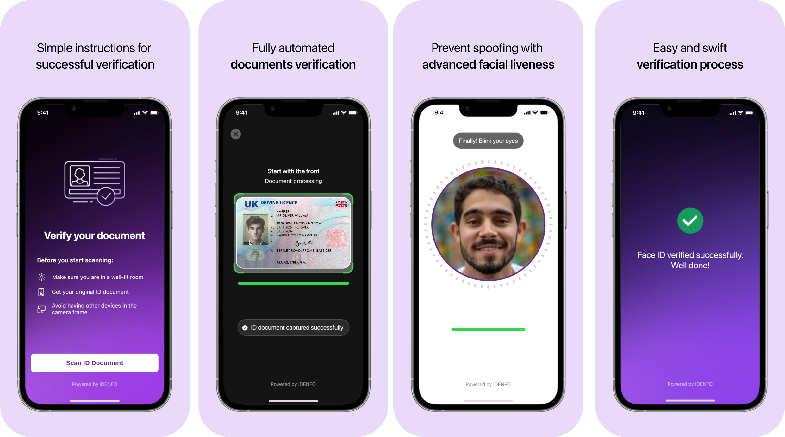

# Features

The Idenfo SDK offers advanced identity verification tools to streamline onboarding, enhance user experiences, and prevent fraud. From real-time liveness detection to OCR integration, each feature is designed to deliver secure and efficient workflows tailored to your business needs. Explore the features below to see how they can elevate your verification processes.

 

### Real-Time Liveness Detection
Idenfo’s advanced liveness detection technology ensures that every verification process is safeguarded against spoofing attempts. By analyzing subtle movements such as blinking, head tilts, and facial expressions, our SDK confirms the physical presence of the user in real time. This feature is indispensable for remote onboarding, guaranteeing the integrity of your verification process by preventing the use of photos, videos, or masks.

### AI-Powered Face Matching
Leverage state-of-the-art facial comparison technology to validate user identities with unparalleled accuracy. Our SDK matches the user’s live image with their official ID photo, ensuring that only legitimate users gain access. This advanced feature significantly reduces identity fraud risks, giving businesses confidence in the authenticity of their customer base while providing a seamless user experience.

### Multi Document Support
Simplify the onboarding process with support for a wide range of identity documents. From national IDs and passports to residence visas, our SDK ensures compatibility with various formats and languages. The intuitive document upload feature facilitates smooth and hassle-free verification for users from diverse backgrounds, helping businesses extend their reach globally.

    - #### Custom Document Training:
        If your organization requires support for specific document types not currently supported, our AI models can be trained to recognize and validate these custom documents. This ensures flexibility and adaptability to meet your unique business needs.

### Comprehensive Anti-Fraud Screening
Enhance security with our robust anti-fraud detection module. By meticulously analyzing key document elements such as watermarks, logos, and signatures, the SDK identifies potential forgeries and ensures document authenticity. This automated process minimizes manual intervention, speeding up verification while maintaining the highest standards of accuracy and reliability.

### Adaptive User Experience with Configurable Presets
Deliver a personalized verification journey tailored to your business needs. Configurable presets enable businesses to select the exact features they want in the SDK directly through the Idenfo portal, making it easy to configure workflows, control verification parameters, and align the user experience with specific compliance or operational requirements—all without compromising security or precision.

See the next section on "Flows" for more information on how to configure these features.

    #### Namescreening:
        Idenfo’s namescreening solution provides comprehensive compliance by featuring:

            - Global Sanction Lists
            - Local Black Lists
            - Politically Exposed Persons (PEP) Lists
            - Real-Time Adverse Media

These features can be configured and monitored through the Idenfo Direct web portal, ensuring an efficient and streamlined compliance process for your business.

### Risk Rating
Our risk rating module allows you to assess and manage customer risk using both default parameters and custom-defined metrics. Businesses can configure these parameters directly on the Idenfo Direct web portal, ensuring they meet specific regulatory and operational requirements.

### OCR Integration
Accelerate onboarding with Optical Character Recognition (OCR) that transforms text from uploaded documents into digital data instantly. By eliminating manual data entry, this feature enhances accuracy and reduces the time required for processing applications. The OCR technology seamlessly integrates with other verification processes, making the entire workflow more efficient and user-friendly.

<!-- ### Real-Time Liveness Detection
Idenfo’s advanced liveness detection technology ensures that every verification process is safeguarded against spoofing attempts. By analyzing subtle movements such as blinking, head tilts, and facial expressions, our SDK confirms the physical presence of the user in real time. This feature is indispensable for remote onboarding, guaranteeing the integrity of your verification process by preventing the use of photos, videos, or masks.  

---

### AI-Powered Face Matching 
Leverage state-of-the-art facial comparison technology to validate user identities with unparalleled accuracy. Our SDK matches the user’s live image with their official ID photo, ensuring that only legitimate users gain access. This advanced feature significantly reduces identity fraud risks, giving businesses confidence in the authenticity of their customer base while providing a seamless user experience.  

---

### Multi-Format Document Upload
Simplify the onboarding process with support for a wide range of identity documents. From national IDs and passports to residence visas, our SDK ensures compatibility with various formats and languages. The intuitive document upload feature facilitates smooth and hassle-free verification for users from diverse backgrounds, helping businesses extend their reach globally.  

---

### Comprehensive Anti-Fraud Screening
Enhance security with our robust anti-fraud detection module. By meticulously analyzing key document elements such as watermarks, logos, and signatures, the SDK identifies potential forgeries and ensures document authenticity. This automated process minimizes manual intervention, speeding up verification while maintaining the highest standards of accuracy and reliability.  

---

### Adaptive User Experience with Configurable Presets
Deliver a personalized verification journey tailored to your business needs. Our SDK adapts to varying environments, whether low-bandwidth networks or devices with different technical capabilities. Configurable presets enable businesses to customize workflows, control verification parameters, and align the user experience with specific compliance or operational requirements—all without compromising security or precision.  

---

### OCR Integration
Accelerate onboarding with Optical Character Recognition (OCR) that transforms text from uploaded documents into digital data instantly. By eliminating manual data entry, this feature enhances accuracy and reduces the time required for processing applications. The OCR technology seamlessly integrates with other verification processes, making the entire workflow more efficient and user-friendly.  -->

<!-- --- -->

<!-- ### OCR Integration  
Our OCR capabilities extract and digitize text from uploaded documents, reducing manual data entry and speeding up the onboarding process. This feature not only improves efficiency but also enhances the accuracy of data captured during verification.

- Automated KYC (Know Your Customer)
Automated KYC simplifies the process of customer identity verification. Our platform uses advanced AI algorithms to verify documents such as IDs, passports, and driver’s licenses in real-time, reducing the need for manual intervention.

Benefits:
- Faster processing times for onboarding.
- Reduced human error in verification.
- Enhanced user experience with minimal friction.

2. Secure Authentication
Our authentication process uses robust encryption and token-based systems to ensure that user data is protected at all times. This ensures compliance with industry standards, such as GDPR, and guarantees that sensitive information remains secure.

Key Components:
- End-to-end encryption.
- Token-based authentication.
- Multi-factor authentication (MFA).

3. Real-Time Verification
Idenfo provides AI-powered tools to instantly verify documents and identities during the onboarding process. This enables you to provide seamless experiences for your customers while ensuring high levels of accuracy and security.

Benefits:
- Real-time fraud detection.
- AI-enhanced decision-making for verification.
- Fast and efficient customer verification.

4. Scalable Architecture
Our system is built to scale with your business. Whether you’re processing hundreds or millions of verifications, Idenfo’s platform can handle high transaction volumes without compromising speed or accuracy.

Features:
Cloud-based infrastructure for elasticity.
Load balancing to manage traffic spikes.
Optimized for high availability.

5. Flexible Integration
Idenfo is designed for easy integration with your existing systems, whether you’re building a mobile app, web application, or enterprise solution. We offer comprehensive API documentation and code samples to help you get started quickly.

 -->

<!-- Integration Methods:
- REST APIs.
- SDKs for iOS, Android, and web platforms.
- Webhooks for event-driven integration. -->