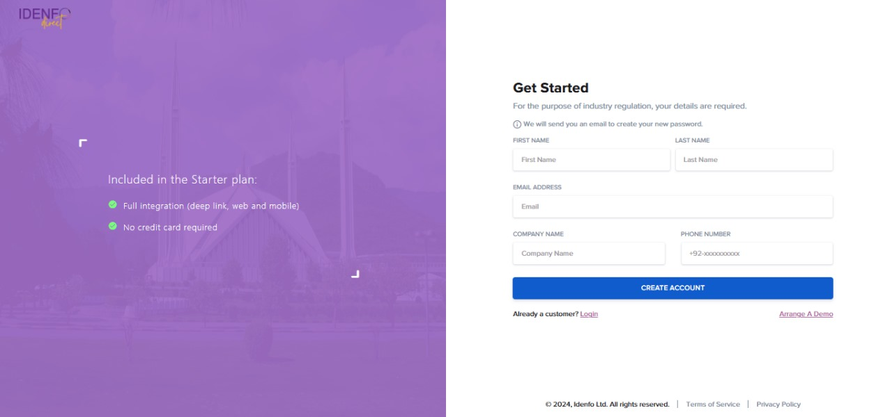

# Create an Account with Idenfo Direct

## Getting Started

Welcome to the Idenfo Identity SDK setup. To begin integrating and configuring your journey flow, follow these simple steps to get started:

---

### 1. Create an Account with Idenfo Direct

To access Idenfo's Identity Verification services and SDKs, you first need to create an account on *Idenfo Direct*.  

**Sign Up Here:** 

- UK Region: [UK Direct](https://pkdirectuat.idenfo.com/signup)
- UAE Region: [UAE Direct](https://pkdirectuat.idenfo.com/signup)
- Pakistan Region: [PK Direct](https://pkdirectuat.idenfo.com/signup)

Once you’ve created an account, you’ll gain access to the Idenfo dashboard, where you can manage your account, configure your SDK journey, and generate your API keys.

Click Next to configure your **SDK Journey Flow**.

