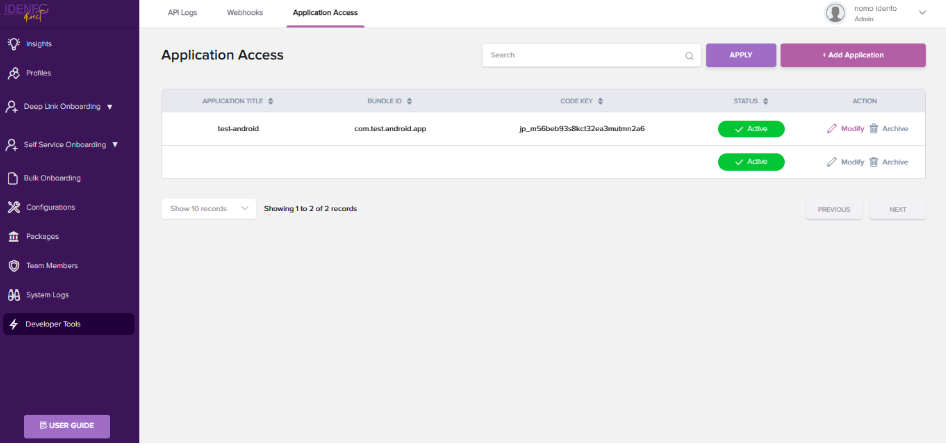

# Generate Your API Keys

<!-- ### *3. Generate API Keys*   -->

To authenticate API requests to our backend services and access the Android SDK Repository via JitPack, you need to generate and securely store your unique **API Key**, **Secret Key**, and **Code Key**. The API and Secret Keys authenticate your requests, while the **Code Key** authorizes SDK access through JitPack. Follow the steps below to generate these keys and get started.

### Steps to Generate API Keys:  

1. Open the **Developer Tools** tab, locate the top navigation bar, and click on **Application Access**.
2. Click the **Add Application** button. A popup window will appear.
In the popup, provide the following details:
    - **Application Title**.
    - **Project Bundle ID**.
    - To enable the **IDV SDK**, set the **SDK Type** option to **YES**. 
    - Select **SDK Type** from Dropdown. (e.g., Android or iOS)
    - Click the **Create button**. to proceed.

3. Once the application is created, click the Modify button. This will display the keys, which you can then use to initialize your app.

4. In the Application Access data table, you can see the **Code Key**, which is used to access the Android repository.

*Important:*
Do not share your API keys publicly or expose them in your application code. Use environment variables or secure key storage practices for production environments.

The mobile SDKs are authenticated using a unique **API Key** and **Secret Key**, which must be provided in the SDK initialization code during integration. Also keep safe the **Code Key**, which is used to access the Android repository. Refer to the **SDK Integration** section for the platform-specific integration guide.