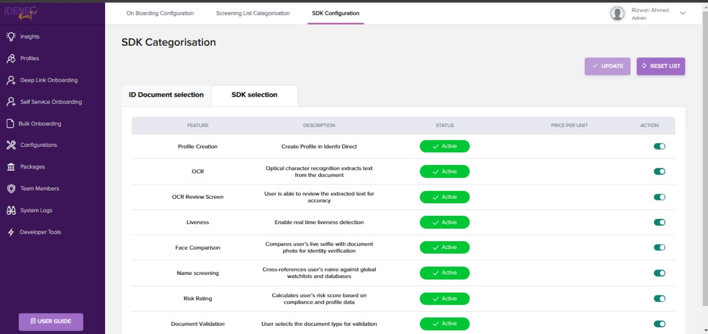

# Configure Your Journey Flow

You have successfully created your account with Idenfo Direct! Now, you can start configuring the SDK flow to align with your business requirements.

### Configure Your Journey Flow

<!-- ### *1. eee Your Journey Flow*   -->

<!-- After signing up, proceed to configure your settings:

   1. Access the Configuration Panel:
      - Navigate to the left sidebar.
      - Click on the **Configuration panel**.
   2. SDK Configuration:
      - Within the **Configuration panel**, click on **SDK Configuration**.
   3. ID Document Selection:
      - The **Configuration tab** allows you to:
         - Select multiple countries for ID documents and SANs.
         - Modify document types (e.g., Passport, ID Card).
         - Enable OCR and face comparison features.
         - Adjust settings for Name Screening and Risk Rating. -->

<!-- ### Configure Your Journey Flow -->

1. **Access the Configuration Panel**

   After signing up, proceed to configure your settings:
   - Navigate to the left sidebar.
   - Click on the Configuration panel.

2. **SDK Configuration**  

   Within the Configuration panel, click on **SDK Configuration**.

3. **Feature Selection**  

   The **Feature Selection** tab allows you to enable or disable the exact features you want in your SDK. For a complete list of these features, please check the features section [click here for futher details](../features).

      

4. **ID Document Selection**  

   The **ID Document Selection** tab allows you to:
   - Select the countries and the documents you want to support in the SDK.
   - The document types include (e.g., Passports, ID Cards, Driver's Licenses).

   

   With your journey flow configured, you're now ready to proceed to the next step **Generating Your API key**.
