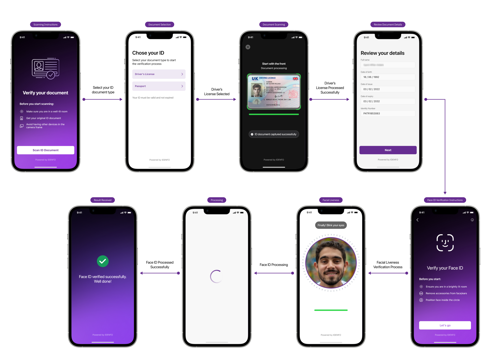

# Overview

Welcome to the Idenfo API Documentation!At Idenfo, we specialize in creating secure, scalable, and user-friendly solutions for customer onboarding and identity verification (ID&V). Our mission is to empower businesses with cutting-edge tools that enhance regulatory compliance, reduce fraud, and deliver seamless customer experiences.

This documentation serves as a comprehensive guide to integrating Idenfo APIs into your systems, whether you’re building a mobile app, web platform, or enterprise software.

### Key Features  
Our platform offers a wide range of functionalities, including:
- Automated KYC (Know Your Customer): Streamline customer onboarding with automated ID verification.
- Secure Authentication: Robust encryption and token-based authentication for secure access.
- Real-Time Verification: AI-powered tools to verify documents and identities in real time.
- Scalable Architecture: Supports high-volume transactions with ease.
- Flexible Integration: Compatible with multiple platforms and technologies.

### Target Audience  

This documentation is designed for:
- Developers: Building applications or services using Idenfo APIs.
- Business Partners: Understanding system capabilities and exploring integration opportunities.
- Technical Teams: Reference for troubleshooting and advanced configurations.

### Why Choose Idenfo?
Idenfo stands out as a trusted partner for identity verification and compliance solutions. Here’s why businesses choose us:

#### 1. Advanced Technology
- AI-Powered Verification: Our intelligent systems ensure accurate and efficient identity verification in real-time.
- Secure Architecture: End-to-end encryption and token-based authentication keep your data safe and compliant with global security standards.

#### 2. Seamless Integration
- Flexible APIs: Easily integrate our solutions with your existing systems, including mobile apps, web platforms, and enterprise tools.
- Scalable Solutions: Designed to handle high volumes of transactions without compromising performance.

#### 3. Global Compliance
- Regulatory Adherence: Fully compliant with KYC, AML (Anti-Money Laundering), and GDPR standards across multiple jurisdictions.
- Localization Support: Adaptable to region-specific regulations and languages for a global audience.

#### 5. Trusted by Leading Brands
-Proven track record with leading banks, financial institutions, and technology partners worldwide.

#### 6. Continuous Innovation
- We’re constantly enhancing our platform to include the latest features, such as biometric authentication, fraud detection, and more.

### Key Benefits for Your Business
- Reduce Onboarding Time: Minimize delays in customer acquisition with automated workflows.
- Mitigate Fraud Risks: Leverage AI to detect and prevent fraudulent activities.
- Enhance Customer Trust: Build credibility with secure and compliant processes.

### How to Use This Documentation
- Navigate through the sections on the left-hand menu to find specific API endpoints, guides, and examples.
- Start with the Getting Started section for a quick overview and integration tutorial.
- Refer to API Reference for detailed information about each endpoint.
- Use Code Samples to see real-world implementation examples in different programming languages.

If you have any questions or need assistance, reach out to our support team at support@idenfo.com.

<!-- ### Comprehensive Anti-Fraud Screening  
Our advanced anti-fraud detection module leverages document analysis techniques to identify key elements such as logos, signatures, and other security features. This automation reduces manual checks and enhances the verification process, making it more efficient and reliable.

### Adaptive User Experience with Configurable Presets  
Our SDK offers an adaptive user experience that adjusts to various environments, including low-bandwidth networks or different device capabilities. Additionally, the SDK supports configurable presets, allowing businesses to customize and control the verification flow to suit specific needs or compliance requirements. This flexibility ensures a tailored experience without compromising accuracy or security.

### OCR Integration  
Our OCR capabilities extract and digitize text from uploaded documents, reducing manual data entry and speeding up the onboarding process. This feature not only improves efficiency but also enhances the accuracy of data captured during verification.

### IDV SDK Flow  

 -->

<!-- ### Getting started

To use Idenfo's IDV mobile SDKs, you must make some preparations

- Obtain authorization keys
- Choose required platform

### Authorization Keys

To generate requests using mobile SDKs, you need to obtain the authorization keys by following the given steps [here](/docs/platforms/ios#authorization). -->