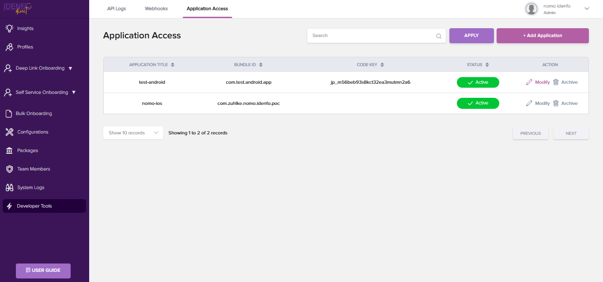

# Generate Your API Keys

### *3. Generate API Keys*  

To integrate the Idenfo Identity Verification SDK with your application, you need to generate API keys.  

#### *Steps to Generate API Keys*:  
<!-- 1. Go to the **Developers Tools** section in your Idenfo dashboard.  
2. Click on **Add Application** and in which u can provide bundle on each SDK then Click on save button.
3. After the creation of API secert, copy the API key and store it securely. You will use this key to authenticate your SDK integration.   -->

1. Open the **Developer Tools** tab, locate the top navigation bar, and click on **Application Access**.
2. Click the **Add Application** button. A popup window will appear.
In the popup, provide the following details:
- **Title**
- **Bundle ID**
- Select the **SDK Type** (e.g., Android or iOS) using the radio buttons. 
- Click the **Create button** to proceed.

3. Once the application is created, click the Modify button. This will display the keys, which you can then use to initialize your app.
4. In the Application Access data table, you can see the **Code Key**, which is used to access the Android repository.

*Important*: Do not share your API keys publicly or expose them in your application code. Use environment variables or secure key storage practices for production environments.

---

<!-- ### *4. Download and Integrate the SDK*  

Once your account is set up, journey flow configured, and API keys generated, download the appropriate SDK for your platform:  

- *Android* SDK: [Download Here](#)  
- *iOS* SDK: [Download Here](#)  
- *Web* SDK: [Download Here](#)  

Refer to the platform-specific integration guides for step-by-step instructions on integrating the SDK into your application.  

---

### *5. Test Your Integration*  

Use the sandbox environment to test your SDK integration and ensure the journey flow works as expected. The sandbox allows you to simulate real-world scenarios, such as:  
- Document uploads.  
- Facial verification.  
- API responses for AML checks.  

Testing your setup in a controlled environment ensures a smooth transition to production.

---

### *6. Move to Production*  

Once you’re satisfied with your testing, you can switch to the production environment by:  
1. Navigating to the *Environment Settings* in your dashboard.  
2. Switching your API key usage from *Sandbox* to *Production*.  

Ensure all configurations are finalized before moving to production to avoid disruptions.  

---

With these steps, your integration with Idenfo's Identity Verification SDK will be up and running, delivering secure and seamless identity verification experiences for your users. -->

