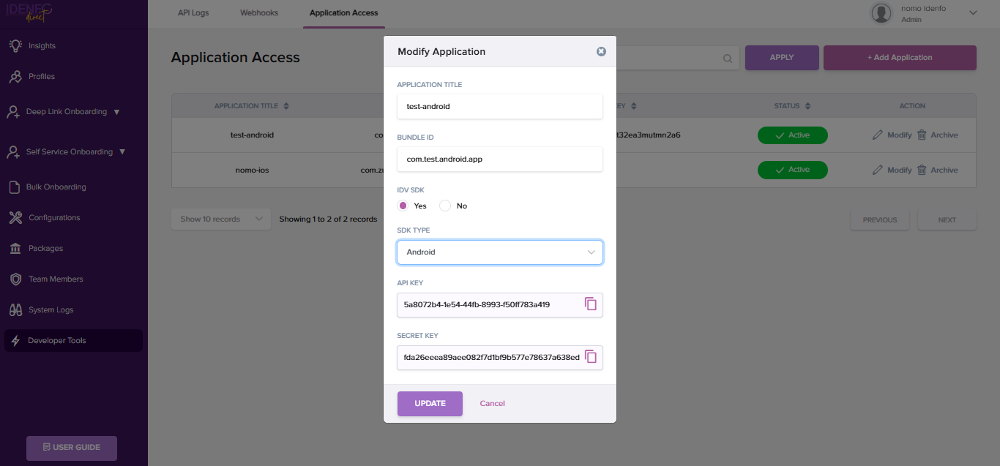

# Generate Your API Keys

<!-- ### *3. Generate API Keys*   -->

To integrate the Idenfo Identity Verification SDK with your application, you need to generate API keys.  

### Steps to Generate API Keys:  

1. Open the **Developer Tools** tab, locate the top navigation bar, and click on **Application Access**.
2. Click the **Add Application** button. A popup window will appear.
In the popup, provide the following details:
    - **Application Title**.
    - **Project Bundle ID**.
    - To enable the **IDV SDK**, set the **SDK Type** option to **YES**. (e.g., Android or iOS) using the radio buttons. 
    - Click the **Create button**. to proceed.

3. Once the application is created, click the Modify button. This will display the keys, which you can then use to initialize your app.
4. In the Application Access data table, you can see the **Code Key**, which is used to access the Android repository.

**Important:** 

    Do not share your API keys publicly or expose them in your application code. Use environment variables or secure key storage practices for production environments.

